# Exercise 7: Credential Access & Attempted Lateral Movement Investigation

## Scenario

On the night of September 14–15, 2026, Wazuh flagged a sequence of discovery activity on a monitored Windows 10 endpoint, followed within hours by an external port scan and a brute-force SSH attack against the Ubuntu server, and — in the minutes that followed the failed SSH attempts — a spike in SMB-port network connections and authentication failures back on the Windows endpoint.

The investigation set out to determine whether these were three unrelated events or a single actor working through a discovery → external recon → credential-access → attempted-pivot sequence. The telemetry was pulled together from Sysmon, Wazuh threat hunting, Windows Security events, and Ubuntu's own authentication log, and the conclusion below is built strictly from what that telemetry shows — not from what the shape of the timeline suggests.

---

## Environment

| Host | Wazuh Agent Name | Agent ID | IP | Role |
|---|---|---|---|---|
| Windows 10 workstation | WIN10-ENDPOINT | 001 | 192.168.56.101 | Monitored endpoint — source of discovery activity, later target of SMB/logon-failure activity |
| Ubuntu server | UBUNTU-SURICATA | — | 192.168.56.102 | Target of Nmap scan and SSH brute-force attempts |
| External host | — (unmonitored) | — | 192.168.56.103 | Source of the Nmap scan and SSH brute-force attempts |

**Host identity note:** Wazuh displays the Windows endpoint under the agent name **WIN10-ENDPOINT**, while its local Windows computer name — visible in some process-context fields as `DESKTOP-TEDQ8NH\SOC` — is the same physical machine. Likewise, the Ubuntu server's shell prompt shows its local hostname as `ubuntu-soc`, while Wazuh's threat-hunting view lists it under the agent name **UBUNTU-SURICATA** — again, one and the same host. Both are treated as single, consistent assets throughout this write-up.

---

## Investigation Objectives

- Verify endpoint and SIEM telemetry collection before analyzing suspicious activity.
- Reconstruct the process chain behind account and privilege discovery on the Windows endpoint.
- Identify network configuration discovery activity.
- Correlate external Nmap scanning with the SSH brute-force attempts that followed.
- Determine whether the SSH brute-force attempt succeeded.
- Determine whether the subsequent Windows-side SMB and logon-failure activity represents an attempted pivot, or a coincidence.
- Map the sequence to MITRE ATT&CK.
- Produce an evidence-based analyst assessment.

---

## Initial Endpoint Verification

Before reviewing the suspicious activity, monitoring infrastructure was confirmed operational on both hosts.

**Windows Wazuh Agent**
```
Get-Service WazuhSvc
```
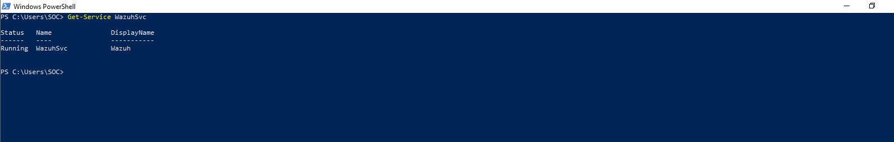
*Figure 1: WazuhSvc confirmed `Running` on the Windows endpoint.*

**Sysmon**
```
Get-Service Sysmon64
```
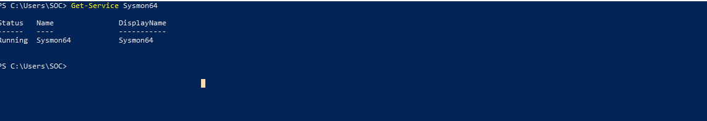
*Figure 2: Sysmon64 confirmed `Running`, ensuring process-creation and network-connection telemetry would be captured for the investigation.*

**Ubuntu Wazuh Agent**
```
sudo systemctl status wazuh-agent
```
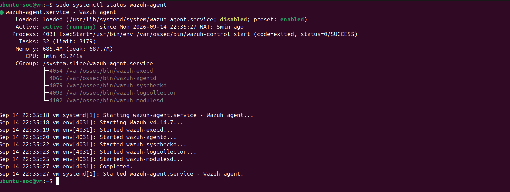
*Figure 3: wazuh-agent.service confirmed `active (running)` on ubuntu-soc, started shortly before the Windows-side discovery activity begins — confirming both hosts were being monitored throughout the incident.*

---

## Phase 1 — Discovery Activity on the Windows Endpoint

The earliest activity captured was a full process chain showing how the first discovery command was actually launched — not just that it ran.

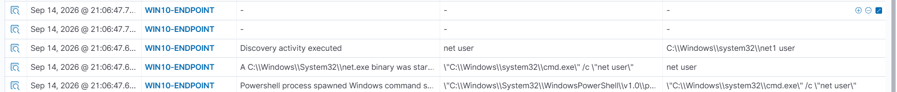
*Figure 14: Wazuh recorded the chain `powershell.exe → cmd.exe /c "net user" → net.exe` (resolving to `net1 user`) on WIN10-ENDPOINT. Two matched rules — "A C:\Windows\System32\net.exe binary was star[ted]" and "Powershell process spawned Windows command shell" — confirm `net user` was launched indirectly through PowerShell rather than typed at an interactive command prompt. This is the opening move of the investigation: account enumeration, launched through a PowerShell wrapper.*

A baseline `whoami.exe` execution was then observed:

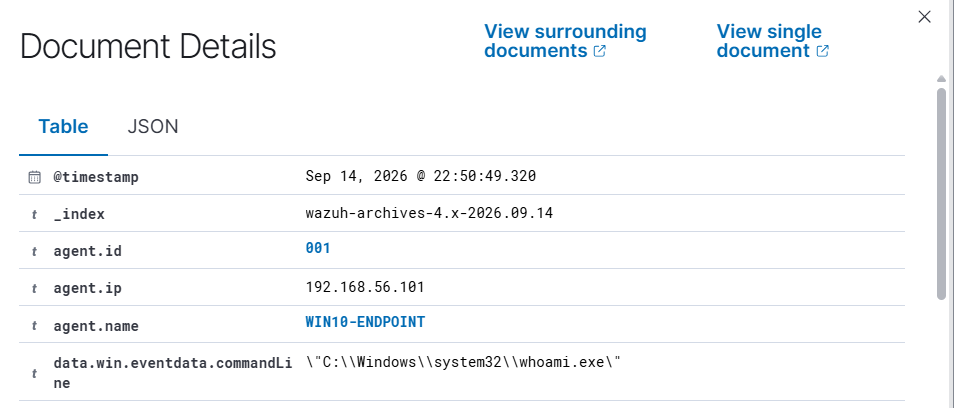
*Figure 4: `whoami.exe` executed on WIN10-ENDPOINT (192.168.56.101) — establishing the account context for the session before the discovery activity escalated.*

Over the following four minutes, the same PowerShell-driven pattern repeated — this time expanding from `net user` to `net localgroup administrators`:

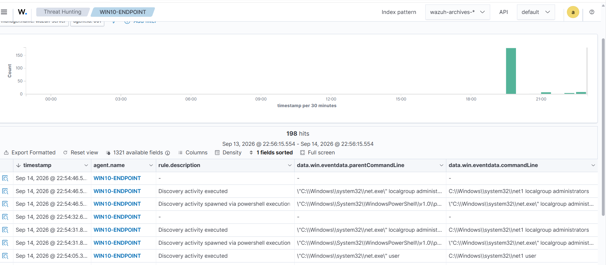
*Figure 5: Wazuh threat-hunting results for WIN10-ENDPOINT (198 hits in the surrounding 24-hour window) show `net.exe user`, followed by two `net.exe localgroup administrators` executions — each one matched by both "Discovery activity executed" and "Discovery activity spawned via powershell execution," with `powershell.exe` as the parent in every case.*

The PowerShell parent process itself was also captured directly:

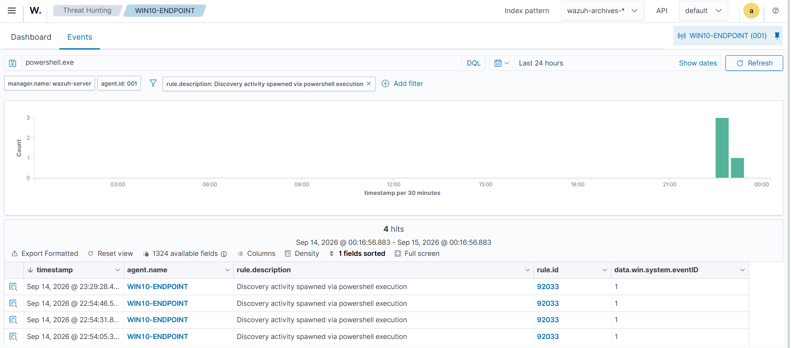
*Figure 12: Filtering specifically on "Discovery activity spawned via powershell execution" (rule 92033) returns exactly four hits, matching the `net.exe` and `arp.exe` events already documented above — confirming the same PowerShell session was responsible for every discovery command in this window, not a series of unrelated executions.*

Privilege discovery followed:

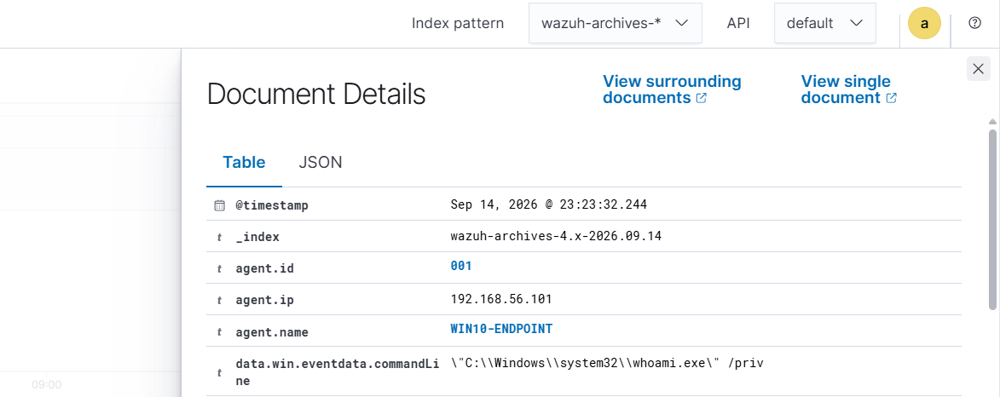
*Figure 6: `whoami.exe /priv` executed on WIN10-ENDPOINT — the account moved from asking "who am I" and "who else is here" to "what am I allowed to do."*

And finally, network configuration discovery:

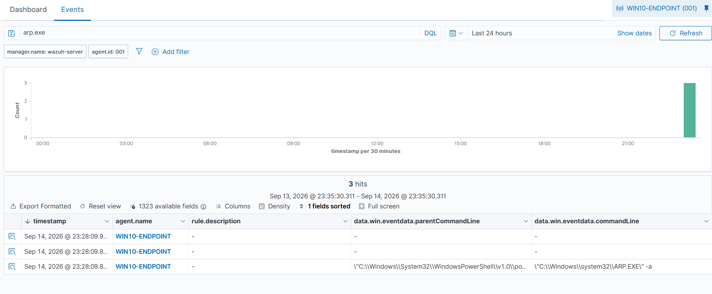
*Figure 7: `arp.exe -a` executed three times in quick succession, again spawned from `powershell.exe`. By this point the enumerated information — local accounts, admin group membership, assigned privileges, and neighboring hosts on the network — would be enough to plan a next move against another system on the same subnet.*

**Assessment of Phase 1:** all discovery activity in this window originated from a single PowerShell session on WIN10-ENDPOINT, escalating in a logical order (identity → accounts → privileges → network map). Shortly after the last discovery command, external scanning activity appeared against the Ubuntu server.

---

## Phase 2 — External Scanning and SSH Credential Access

```
nmap -sV 192.168.56.102
```

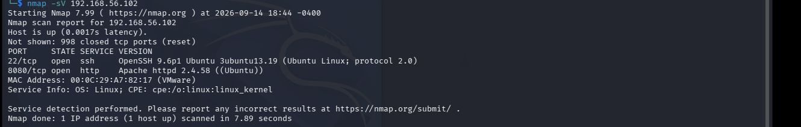
*Figure 8: A service-version scan of the Ubuntu server (192.168.56.102) was run from 192.168.56.103. The scan identified two open ports: 22/tcp (OpenSSH 9.6p1, Ubuntu) and 8080/tcp (Apache httpd 2.4.58). SSH being open — and subsequently targeted — is the key difference from earlier attempts at this exercise, where the scanned and attacked services didn't line up.*

Shortly after, SSH authentication attempts began against that same server:

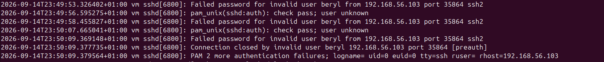
*Figure 9: `/var/log/auth.log` on ubuntu-soc shows repeated failed SSH logins for invalid user "beryl" from 192.168.56.103 — the same IP that ran the Nmap scan. Each attempt returned "Failed password for invalid user," "authentication failure," and "user unknown," and the client closed the connection after PAM logged two more authentication failures. No successful authentication appears in this log for the account.*

The same activity was independently confirmed in Wazuh:

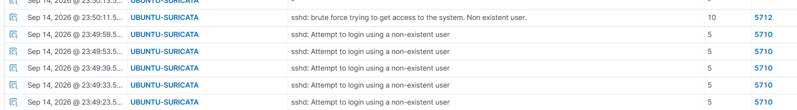
*Figure 10: Wazuh's UBUNTU-SURICATA feed shows the same window, matched against rule 5710 ("Attempt to login using a non-existent user") and rule 5712 ("sshd: brute force trying to get access to the system. Non existent user"), corroborating the auth.log findings from an independent source.*

**Assessment of Phase 2:** the same external IP that scanned the Ubuntu server for open services returned five minutes later and attempted SSH authentication against a non-existent account. The attempt failed outright — no valid credentials were guessed, and no session was established.

---

## Phase 3 — Activity on the Windows Endpoint Following the Failed SSH Attempt

Shortly after the failed SSH brute-force against the Ubuntu server, two things happened back on the Windows endpoint: a spike in SMB-related network connections, and a cluster of failed logon attempts.

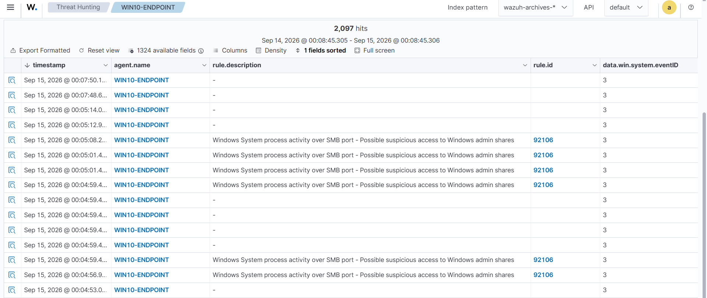
*Figure 11: Sysmon Event ID 3 (Network Connection) telemetry on WIN10-ENDPOINT shows 2,097 hits in the surrounding 24-hour window, with rule 92106 ("Windows System process activity over SMB port - Possible suspicious access to Windows admin shares") firing repeatedly in a tight cluster directly adjacent to the failed Ubuntu SSH attempt.*

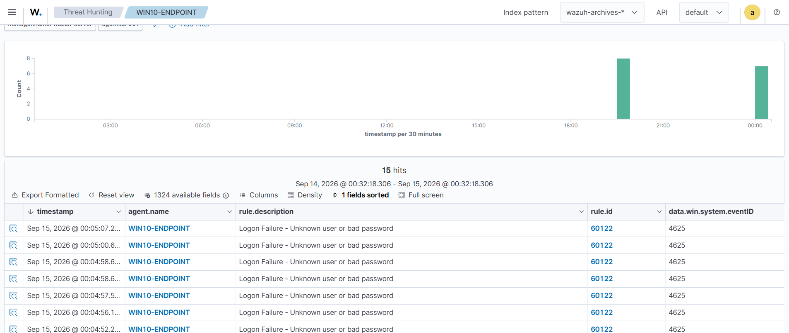
*Figure 13: A search for Windows Security Event ID 4625 on WIN10-ENDPOINT returns 15 hits, with a cluster of seven landing in the same few minutes as the SMB spike in Figure 11 — all matched to rule 60122, "Logon Failure - Unknown user or bad password."*

**Assessment of Phase 3:** the timing is tight enough to be worth flagging — SMB port activity and Windows logon failures cluster in the same four-minute window that immediately follows the failed SSH brute-force on the Ubuntu server. That said, **neither Figure 11 nor Figure 13 surfaces a source IP field**, so this correlation is temporal only. It is documented as a plausible attempted pivot from the same external actor toward the Windows endpoint, not a confirmed one. No Event ID 4624 (successful logon) was found in this window, so even if this was a pivot attempt, it did not result in confirmed access.

---

## Attack Timeline

| Time (Sep 14–15, 2026) | Host | Activity |
|---|---|---|
| 22:35 | ubuntu-soc | Wazuh agent confirmed active (pre-investigation check) |
| 21:06:47 | WIN10-ENDPOINT | `powershell.exe → cmd.exe → net.exe` — `net user` (process chain captured) |
| 22:50:49 | WIN10-ENDPOINT | Baseline `whoami.exe` |
| 22:54:05 | WIN10-ENDPOINT | `net user` via PowerShell |
| 22:54:31 – 22:54:46 | WIN10-ENDPOINT | `net localgroup administrators` (x2) via PowerShell |
| 23:23:32 | WIN10-ENDPOINT | `whoami /priv` — privilege discovery |
| 23:28:09 | WIN10-ENDPOINT | `arp -a` (x3) — network discovery |
| 23:29:28 | WIN10-ENDPOINT | Final PowerShell-spawned discovery event |
| 23:44 (18:44 -0400) | 192.168.56.103 → .102 | Nmap `-sV` scan — ports 22 (SSH) and 8080 (HTTP) found open |
| 23:49:53 – 23:50:09 | 192.168.56.103 → ubuntu-soc | Repeated failed SSH logins, invalid user "beryl" |
| 00:04:52 – 00:05:07 (Sep 15) | WIN10-ENDPOINT | Cluster of 4625 logon failures |
| 00:04:53 – 00:07:50 (Sep 15) | WIN10-ENDPOINT | Spike of SMB-port network connections (rule 92106) |

---

## MITRE ATT&CK Mapping

| Activity | Technique |
|---|---|
| `whoami`, `whoami /priv` | T1033 – System Owner/User Discovery; T1069 – Permission Groups Discovery |
| `net user`, `net localgroup administrators` | T1087 – Account Discovery |
| `arp -a` | T1016 – System Network Configuration Discovery |
| PowerShell as the execution vector for every discovery command | T1059.001 – Command and Scripting Interpreter: PowerShell |
| Nmap `-sV` scan | T1046 – Network Service Discovery |
| SSH brute-force against non-existent user | T1110.001 – Brute Force: Password Guessing |
| SMB-port connection spike / possible admin-share access attempt | T1021.002 – Remote Services: SMB/Windows Admin Shares (attempted, unconfirmed) |
| Windows logon failures (4625) | T1110.001 – Brute Force: Password Guessing |

---

## Analyst Assessment

This investigation traces a coherent, single-night sequence: PowerShell-driven account, privilege, and network discovery on the Windows endpoint, followed shortly after by an external service scan of the Ubuntu server, followed shortly after that by a failed SSH brute-force attempt against the same server. Shortly after that failed SSH attempt, the Windows endpoint recorded a cluster of SMB-port connections and logon failures. Full timestamps for each event are in the Attack Timeline below.

**No successful authentication was confirmed at any point** — not via SSH (auth.log and Wazuh both show only failures), and not via Windows logon (only 4625 events were found; no 4624 appeared in the same window). The discovery phase and the external scan/brute-force phase are tied together by IP (192.168.56.103 both scanned and attacked the Ubuntu server) and by tight timing. The link between the SSH brute-force and the subsequent Windows-side SMB/logon-failure spike is **temporal, not source-confirmed** — the relevant Wazuh views did not surface a source IP for those events — and is documented as a plausible attempted pivot rather than a proven one.

**Final determination:** the investigation identified coordinated discovery, external reconnaissance, and credential-access activity, with a strong temporal indication of an attempted pivot toward the Windows endpoint. It found no evidence that any authentication attempt succeeded, and therefore no confirmed lateral movement.

---

## Impact Assessment

- **Authentication outcome:** Failed throughout — SSH and Windows logon telemetry both show failures only.
- **Accounts targeted:** Non-existent user ("beryl") over SSH; unspecified accounts over Windows logon.
- **Systems contacted:** Ubuntu server (SSH, HTTP); Windows endpoint (SMB port, local logon).
- **Evidence of successful remote access:** None found.
- **Evidence of confirmed lateral movement:** None found — temporal correlation only, source IP not confirmed on the Windows-side events.

Classification: **attempted credential access, reconnaissance, and a suspected but unconfirmed pivot attempt.**

---

## Recommendations

- Add a source-IP field to the Sysmon Event ID 3 / SMB-port (rule 92106) and 4625 views so a temporal correlation like the one in Phase 3 can be confirmed or ruled out with evidence, not inference.
- Alert on repeated SSH login failures for non-existent users from a single source IP, especially within minutes of a service scan from the same source.
- Alert when a Nmap-style scan of a host is followed shortly after by authentication attempts against a *different* host on the same subnet — this is a classic recon-then-pivot pattern worth a correlation rule on its own.
- Continue enabling and reviewing Sysmon Event ID 3 on Windows endpoints; it was directly useful here for spotting the SMB spike.
- Explicitly pair every 4625 investigation with a 4624 search over the same window to positively rule successful logon in or out.
- Restrict unnecessary SMB and SSH exposure between internal hosts, and enforce account lockout policies to blunt this kind of brute-force pattern.

---


## Learning Outcomes

- Reconstructing a full process chain (PowerShell → cmd.exe → net.exe) rather than treating each command as an isolated event
- Correlating an external Nmap scan with subsequent authentication activity against the same target
- Cross-validating SSH brute-force findings between raw auth.log and SIEM-side detection rules
- Using Sysmon Event ID 3 to detect SMB-port activity and recognizing the difference between a custom alert rule and the underlying raw event
- Distinguishing a strong temporal correlation from a confirmed, source-verified one — and saying so plainly instead of rounding up to "lateral movement"
- Mapping a full discovery-to-credential-access sequence to MITRE ATT&CK
